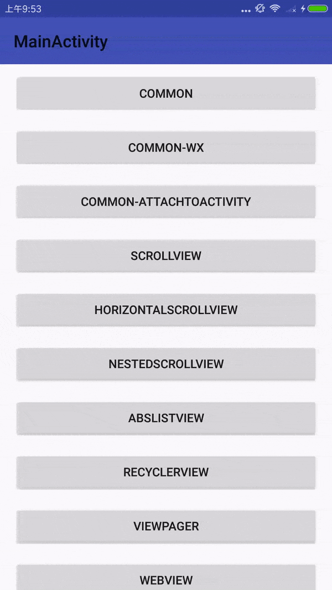

 知识点：1 设置Activity 透明 
        2 根view 设置为自定义的SwipeBackLayout
        3 ViewDragHelper的使用
        4 overridePendingTransition activity 关闭动画取消


SwipeBackLayout
---
[中文版点我](README-CN.md)

SwipeBackLayout is an android library that can finish an activity by using gesture.

You can set the slide direction,such as FROM_LEFT,FROM_TOP,FROM_RIGHT and FROM_BOTTOM.

You can also set whether it can only slide from the edge.
## Screenshots

| Custom-Style | WeChat-Style |
| ------------ | ------------- |
|  |   |

Sample Apk Download
---
[sample apk download](https://github.com/gongwen/SwipeBackLayout/raw/master/sample-apks/app-debug-1.0.2.apk)

Usage
---
##### Gradle
```
dependencies {
    compile 'com.gongwen:swipeback:1.0.2'
}
```
###### [Layout](app/src/main/res/layout/activity_common.xml)
```
<com.gw.swipeback.SwipeBackLayout xmlns:android="http://schemas.android.com/apk/res/android"
    xmlns:app="http://schemas.android.com/apk/res-auto"
    android:id="@+id/swipeBackLayout"
    android:layout_width="match_parent"
    android:layout_height="match_parent"
    app:directionMode="left"
    app:isSwipeFromEdge="true"
    app:maskAlpha="125"
    app:swipeBackFactor="0.5">

	<!-- SwipeBackLayout must contains only one direct child -->

</com.gw.swipeback.SwipeBackLayout>
```

```
<com.gw.swipeback.WxSwipeBackLayout xmlns:android="http://schemas.android.com/apk/res/android"
    xmlns:app="http://schemas.android.com/apk/res-auto"
    android:id="@+id/swipeBackLayout"
    android:layout_width="match_parent"
    android:layout_height="match_parent"
    app:directionMode="left"
    app:isSwipeFromEdge="true"
    app:maskAlpha="125"
    app:swipeBackFactor="0.5">

	<!-- WxSwipeBackLayout must contains only one direct child -->

</com.gw.swipeback.WxSwipeBackLayout>

```
**Attention：**
If you are using WxSwipeBackLayout , you must call **WxSwipeBackActivityManager.getInstance().init(this)** to init it in Application.
just like :
```
public class MainApplication extends Application {
    @Override
    public void onCreate() {
        super.onCreate();
        WxSwipeBackActivityManager.getInstance().init(this);
    }
}
```

###### Attributes
| Attribute 属性          | Description 描述 |
|:---				     |:---|
| swipeBackFactor        |    set the factor of swipeback       |
| maskAlpha        | set the background alpha at the beginning of swipeback            |
| directionMode         |  set the direction of swiping to finish          |
| isSwipeFromEdge         | set whether it can only slide from the edge          |

###### [Code](app/src/main/java/com/gw/swipebacksample/activity/CommonAttachToActivity.java)
```
public void onCreate(@Nullable Bundle savedInstanceState) {
    super.onCreate(savedInstanceState);
    //SwipeBackLayout is included in the layout
    setContentView(layoutId);
    SwipeBackLayout mSwipeBackLayout = (SwipeBackLayout) findViewById(R.id.swipeBackLayout);
    mSwipeBackLayout.setDirectionMode(SwipeBackLayout.FROM_LEFT);
    mSwipeBackLayout.setMaskAlpha(125);
    mSwipeBackLayout.setSwipeBackFactor(0.5f);
    mSwipeBackLayout.setSwipeBackListener(new SwipeBackLayout.OnSwipeBackListener() {
        @Override
        public void onViewPositionChanged(View mView, float swipeBackFraction, float SWIPE_BACK_FACTOR) {
            
        }
    
        @Override
        public void onViewSwipeFinished(View mView, boolean isEnd) {
    
        }
    });
}
```
or
```
public void onCreate(@Nullable Bundle savedInstanceState) {
    super.onCreate(savedInstanceState);
    SwipeBackLayout mSwipeBackLayout = new SwipeBackLayout(this);
    mSwipeBackLayout.addView(contentView);
    setContentView(mSwipeBackLayout);
}
```
or
```
public void onCreate(@Nullable Bundle savedInstanceState) {
    super.onCreate(savedInstanceState);
    //SwipeBackLayout is not included in the layout
    setContentView(layoutId);
    mSwipeBackLayout = new SwipeBackLayout(this);
    mSwipeBackLayout.attachToActivity(this);
}
```
##### [Theme](app/src/main/res/values/styles.xml)
```
<style name="Theme.Swipe.Back.NoActionBar" parent="AppTheme">
    <item name="android:windowIsTranslucent">true</item>
    <item name="android:windowBackground">@android:color/transparent</item>
</style>
```

Support Views
---
SwipeBackLayout must contains only one direct child.

Such as:
* LinearLayout,RelativeLayout,FrameLayout,TableLayout etc.
* ScrollView,HorizontalScrollView,NestedScrollView etc.
* RecyclerView,the subClass of AbsListView(ListView etc.)
* ViewPager,WebView etc.

reference
---
##### [ViewDragHelper详解](http://www.jcodecraeer.com/a/anzhuokaifa/androidkaifa/2014/0911/1680.html)
##### [SwipeBack](https://github.com/liuguangqiang/SwipeBack/)
##### [BGASwipeBackLayout-Android](https://github.com/bingoogolapple/BGASwipeBackLayout-Android)
License
---
    Copyright (C) 2017 1798550470@qq.com

    Licensed under the Apache License, Version 2.0 (the "License");
    you may not use this file except in compliance with the License.
    You may obtain a copy of the License at

    http://www.apache.org/licenses/LICENSE-2.0

    Unless required by applicable law or agreed to in writing, software
    distributed under the License is distributed on an "AS IS" BASIS,
    WITHOUT WARRANTIES OR CONDITIONS OF ANY KIND, either express or implied.
    See the License for the specific language governing permissions and
    limitations under the License.